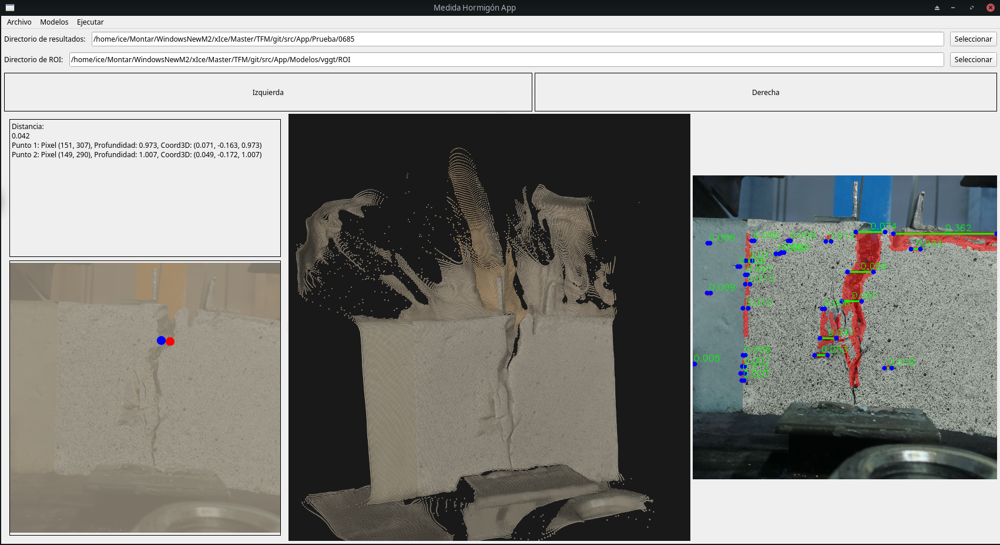
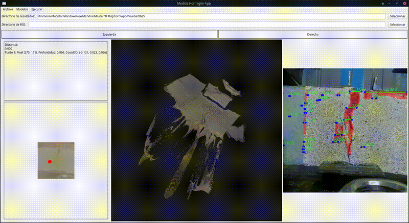

# Aplicación para el análisis de rotura en probetas de hormigón

Este proyecto consiste la implementación de una aplicacion que a partir de un par de imágenes estéreo, detecta las grietas que se hayan podido producir en una probeta de hormigón y devuelve una estimación relativa de su tamaño.

## 👤 Autor y Tutores

> **Autor:** Víctor Pérez Esteban
> **Tutores:** Pedro Latorre Carmona, Álvaro Mena Alonso

## 🖼️ Imágenes




## Requisitos de usuarios
Tener instalado Python 3. Y se recomienda tener instalado Conda para crear un entorno donde instalar todas las dependencias de Python.

Tener los siguientes archivos de los modelos:

En src/App/Modelos/vggt/model.pt -> https://huggingface.co/facebook/VGGT-1B/blob/main/model.pt

En src/DEFOM-Stereo/DEFOM-Stereo-main/defomstereo_vitl_eth3d.pth -> https://drive.google.com/drive/folders/1cZLcIjHlmUo986gkR6FbofG1cj5BT36x

En src/DEFOM-Stereo/DEFOM-Stereo-main/defomstereo_vitl_kitti.pth -> https://drive.google.com/drive/folders/1cZLcIjHlmUo986gkR6FbofG1cj5BT36x

En src/DEFOM-Stereo/DEFOM-Stereo-main/defomstereo_vitl_middlebury.pth -> https://drive.google.com/drive/folders/1cZLcIjHlmUo986gkR6FbofG1cj5BT36x

En src/DEFOM-Stereo/DEFOM-Stereo-main/defomstereo_vitl_sceneflow.pth -> https://drive.google.com/drive/folders/1cZLcIjHlmUo986gkR6FbofG1cj5BT36x

En src/DEFOM-Stereo/DEFOM-Stereo-main/defomstereo_vits_rvc.pth -> https://drive.google.com/drive/folders/1cZLcIjHlmUo986gkR6FbofG1cj5BT36x

En src/DEFOM-Stereo/DEFOM-Stereo-main/defomstereo_vits_sceneflow.pth -> https://drive.google.com/drive/folders/1cZLcIjHlmUo986gkR6FbofG1cj5BT36x

En src/DetectorEsquinas/Esquinas/d2_tf.pth -> https://dusmanu.com/files/d2-net/d2_tf.pth

En src/DetectorEsquinas/Esquinas/faster2d2_WASF_N8_big.pt -> https://github.com/naver/r2d2/tree/master/models


## Instalación
Para instalarlo se necesita clonar el repositorio o descargar el zip desde https://github.com/vperee00/Medida-Rotura-3D-Hormig-n/tree/master

Para crear el entorno con todas las dependencias necesarias se puede usar el archivo environment.yml con el siguiente comando.
```bash
conda env create -f environment.yml
```

Y descargar el archivo del modelo se puede encontrar en https://huggingface.co/facebook/VGGT-1B/blob/main/model.pt

## Ejecución
Para ejecutar la aplicación se puede usar el script creado para ese efecto: 
```bash
./ejecutar_app.sh
```

O de forma manual con:
```bash
	conda activate vggt
	python main.py
	conda deactivate
```

## Procesar par de imágenes
Para procesar un par de imágenes, selecciona un directorio donde se guardaran todos los archivos generados desde el botón seleccionar a la derecha del campo de texto correspondiente. Con los botones Izquierda y derecha, selecciona cada imagén del par estéro. Y con el botón Ejecutar de la parte superior comenzará el proceso. Con los datos generados previamente se puede seleccionar un nuevo par de de imágenes para que sirvan de referencia para seleccionar la zona de ROI. Si no se selecciona nada se usará uno por defecto generado previamente.

## Cargar datos generados
Para volver a visualizar los datos que se hayan procesado previamente, selecciona el directorio donde se hayan guardado todos los archivos, y a continuación desde el menú Archivo, selecciona Cargar 3D.

# 
