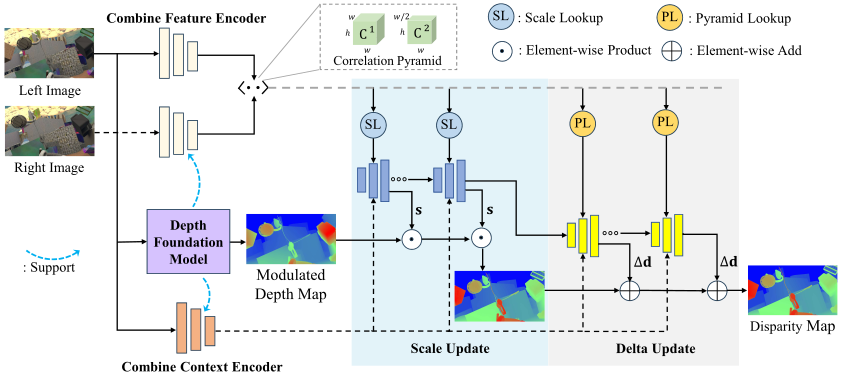
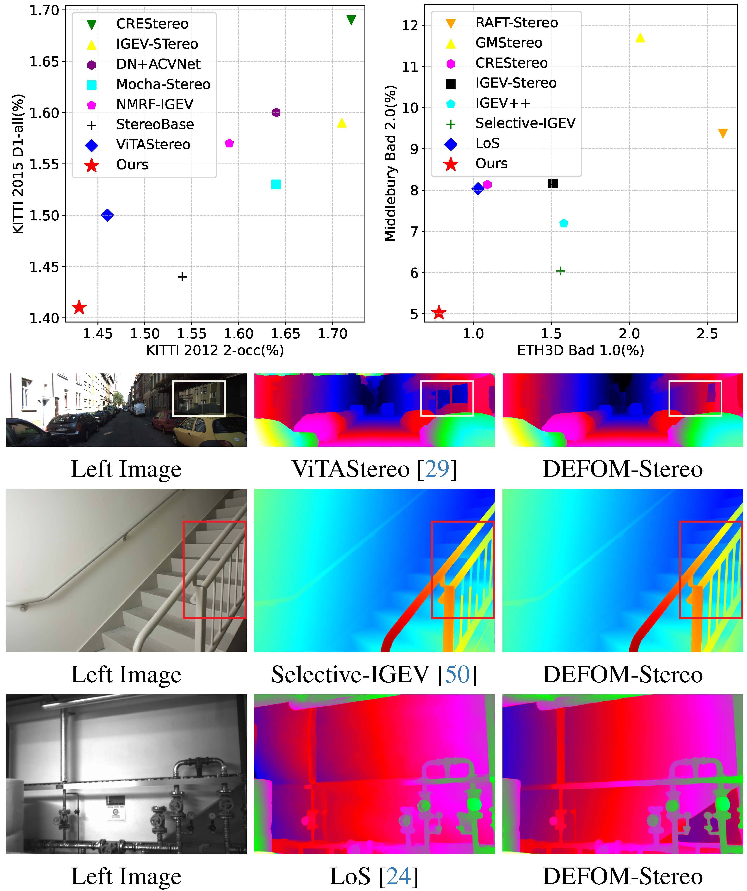
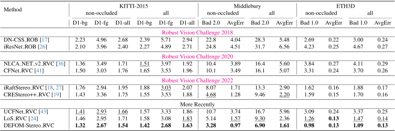

# DEFOM-Stereo [CVPR 2025]

The Official Pytorch Implementation for

> [**DEFOM-Stereo: Depth Foundation Model Based Stereo Matching**](https://arxiv.org/abs/2501.09466)
>
> Authors: Hualie Jiang, Zhiqiang Lou, Laiyan Ding, Rui Xu, Minglang Tan, Wenjie Jiang and Rui Huang

# Abstract
Stereo matching is a key technique for metric depth estimation in computer vision and robotics. 
Real-world challenges like occlusion and non-texture hinder accurate disparity estimation from binocular matching cues. Recently, monocular relative depth estimation has shown remarkable generalization using vision foundation models. Thus, to facilitate robust stereo matching with monocular depth cues, we incorporate a robust monocular relative depth model into the recurrent stereo-matching framework, building a new framework for depth foundation model-based stereo-matching, DEFOM-Stereo. 
In the feature extraction stage, we construct the combined context and matching feature encoder by integrating features from conventional CNNs and DEFOM. In the update stage, we use the depth predicted by DEFOM to initialize the recurrent disparity and introduce a scale update module to refine the disparity at the correct scale. DEFOM-Stereo is verified to have much stronger zero-shot generalization compared with SOTA methods. Moreover, DEFOM-Stereo achieves top performance on the KITTI 2012, KITTI 2015, Middlebury, and ETH3D benchmarks, ranking $1^{st}$ on many metrics. In the joint evaluation under the robust vision challenge, our model simultaneously outperforms previous models on the individual benchmarks, further demonstrating its outstanding capabilities.


# Pipeline
<p align="center">

</p>

- We propose **a novel recurrent stereo-matching framework incorporating monocular depth cues** from a depth foundation model to improve robustness. 
- We develop a simple technique that utilizes **pre-trained DEFOM features** to construct stronger **combined feature and context encoders**.
- We invent a **recurrent scale update** module empowered with the **scale lookup**, serving to recover accurate pixel-wise scales for the coarse DEFOM depth.


# Zero-Shot Perfomance

<p align="center">

</p>

# Benchmark Performance

<p align="center">

</p>

# Robust Vision Challange

<p align="center">

</p>

# Preparation

### Installation

Create the environment

```bash
conda env create -f environment.yaml
conda activate defomstereo
pip install -r requirements.txt
```


### Datasets 
The project requires the follow datasets:

<table style="border-collapse: collapse; width: 80%;">
  <tr>
    <td style="border: 1px solid #000; padding: 8px;"><a class="custom-link" href="https://www.cvlibs.net/datasets/kitti/eval_stereo_flow.php?benchmark=stereo" target="_blank">KITTI-2012</a></td>
    <td style="border: 1px solid #000; padding: 8px;"><a class="custom-link" href="https://www.cvlibs.net/datasets/kitti/eval_scene_flow.php?benchmark=stereo" target="_blank">KITTI-2015</a></td>
    <td style="border: 1px solid #000; padding: 8px;"><a class="custom-link" href="https://vision.middlebury.edu/stereo/submit3/" target="_blank">Middlebury</a></td>
    <td style="border: 1px solid #000; padding: 8px;"><a class="custom-link" href="https://www.eth3d.net/datasets" target="_blank">ETH3D</a></td>
    <td style="border: 1px solid #000; padding: 8px;"><a class="custom-link" href="https://github.com/YuhuaXu/StereoDataset" target="_blank">InStereo2K</a></td>
  </tr>
  <tr>
    <td style="border: 1px solid #000; padding: 8px;"><a class="custom-link" href="https://europe.naverlabs.com/proxy-virtual-worlds-vkitti-2/" target="_blank">Virtual KITTI 2</a></td>
    <td style="border: 1px solid #000; padding: 8px;"><a class="custom-link" href="https://lmb.informatik.uni-freiburg.de/resources/datasets/SceneFlowDatasets.en.html" target="_blank">SceneFlow</a></td>
    <td style="border: 1px solid #000; padding: 8px;"><a class="custom-link" href="https://github.com/castacks/tartanair_tools" target="_blank">TartanAir</a>
</td>
    <td style="border: 1px solid #000; padding: 8px;"><a class="custom-link" href="https://github.com/megvii-research/CREStereo" target="_blank">CREStereo Dataset</a>
</td>
    <td style="border: 1px solid #000; padding: 8px;"><a class="custom-link" href="https://research.nvidia.com/publication/2018-06_falling-things-synthetic-dataset-3d-object-detection-and-pose-estimation" target="_blank">FallingThings</a>
</td>
  </tr>
  <tr>
    <td style="border: 1px solid #000; padding: 8px;"><a class="custom-link" href="http://sintel.is.tue.mpg.de/stereo" target="_blank">Sintel Stereo</a></td>
    <td style="border: 1px solid #000; padding: 8px;"><a class="custom-link" href="https://drive.google.com/file/d/1SgEIrH_IQTKJOToUwR1rx4-237sThUqX/view" target="_blank">HR-VS</a></td>
    <td style="border: 1px solid #000; padding: 8px;"><a class="custom-link" href="https://github.com/sniklaus/3d-ken-burns" target="_blank">3D Ken Burns</a></td>
    <td style="border: 1px solid #000; padding: 8px;"><a class="custom-link" href="https://github.com/HKBU-HPML/IRS" target="_blank">IRS Dataset</a></td>
    <td style="border: 1px solid #000; padding: 8px;"><a class="custom-link" href="https://cvlab-unibo.github.io/booster-web/" target="_blank">Booster Dataset</a></td>
  </tr>
</table>
The datasets are organized as follows,

```
.
└── datasets
    ├── 3dkenburns
    │   ├── asdf-flying
    │   ├── asdf-flying-depth
    │   └── ...
    ├── Booster_Dataset
    │   ├── test
    │   └── train
    ├── CreStereo
    │   ├── hole
    │   ├── reflective
    │   ├── shapenet
    │   └── tree
    ├── ETH3D
    │   ├── two_view_testing
    │   ├── two_view_training
    │   └── two_view_training_gt
    ├── FallingThings
    │   └── fat
    ├── HRVS
    │   └── carla-highres
    ├── InStereo2K
    │   ├── part1
    │   ├── part2
    │   ├── part3
    │   ├── part4
    │   ├── part5
    │   └── test
    ├── IRSDataset 
    │   ├── Home
    │   ├── Office
    │   ├── Restaurant
    │   └── Store
    ├── KITTI12
    │   ├── testing
    │   └── training
    ├── KITTI15
    │   ├── testing
    │   └── training
    ├── Middlebury
    │   ├── 2005
    │   ├── 2006
    │   ├── 2014
    │   ├── 2021
    │   └── MiddEval3
    ├── SceneFlow
    │   ├── Driving
    │   ├── FlyingThings3D
    │   └── Monkaa
    ├── SintelStereo 
    │   └── training
    ├── TartanAir
    │   ├── abandonedfactory
    │   ├── abandonedfactory_night
    │   └── ...
    └── VKITTI2 
        ├── Scene01
        ├── Scene02
        ├── Scene06
        ├── Scene18
        └── Scene20
```


# Evaluation

### Download the pre-trained models
```
bash scripts/download_models.sh
```

The pretrained models are available on [Google Drive](https://drive.google.com/drive/folders/1cZLcIjHlmUo986gkR6FbofG1cj5BT36x?usp=sharing) and can be downloaded mamanually. 

### Perfom Evaluation
```
bash scripts/evaluate.sh
```

# Make Benchmark Submission

```
bash scripts/make_submission.sh
```


# Training 

### Download DaV2 models
```
bash scripts/download_dav2.sh
```


### Train on SceneFlow

```
bash scripts/train_sceneflow_vits.sh
bash scripts/train_sceneflow_vitl.sh
```

### Finetune for Benchmarks

```
bash scripts/train_kitti.sh
bash scripts/train_middlebury.sh
bash scripts/train_eth3d.sh
bash scripts/train_rvc.sh
```


# Domo on real samples  

```
python demo.py --restore_ckpt checkpoints/defomstereo_vitl_sceneflow.pth
```


## Acknowledgements

The project is based on [RAFT-Stereo](https://github.com/princeton-vl/RAFT-Stereo) and [Depth Anything V2](https://github.com/DepthAnything/Depth-Anything-V2) and we sincerely acknowledge their authors for opensourcing the excellent work. Besides, we would like to thank the CVPR reviewers and AC for their valuable feedback and recognition of our work.
 

## Citation

Please cite our paper if you find our work useful in your research.

```
@inproceedings{jiang2025defom,
  title={DEFOM-Stereo: Depth Foundation Model Based Stereo Matching},
  author={Jiang, Hualie and Lou, Zhiqiang and Ding, Laiyan and Xu, Rui and Tan, Minglang and Jiang, Wenjie and Huang, Rui},
  booktitle={IEEE International Conference on Computer Vision and Pattern Recognition (CVPR)},
  year={2025}
}
```
